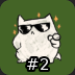

# For Users

## Available Actions

VeadoSC provides two actions for managing your PNGTubers within veadotube:

* **Set State**: Use this when you want to change states within veadotube for a prolonged period
    of time. This will change state when you press the button on your Stream Deck, and will remain
    set until you change the state again, either via VeadoSC, in veadotube, or via another
    application.
* **Toggle State**: Use this if you want to change states for a short time, then go back to the
    previous state. As an example, Toggle State works well if you want to briefly show a
    "surprised" expression, then go back to normal. Toggle State will change state to the selected
    state when you press the button on your Stream Deck, then will go back to your previous state
    when you release the button.

### Unavailable Actions

* **Push to "Talk"**: Push to "Talk" is supported via websocket in veadotube mini 2.1a, but is not
    supported in VeadoSC. If you'd like to see this supported, comment on
    [the tracking issue](https://github.com/Kekemui/VeadoSC/issues/21) - or better yet, take it on
    yourself!

## Colors and Icons

VeadoSC uses a few colors and icons to display its current status.

Icon | Description |
-----|--------------
 | Bright green indicates the currently selected state in veadotube.
 | Dark green indicates this is a valid state, but is not currently selected in veadotube
 | A crossed box on a red background indicates that VeadoSC is currently connected to veadotube, but cannot find the State you've configured on the action. This can happen if you rename states withinveadotube, or if you load a different mini avatar.
 | The disconnected icon on a red background indicates just that - VeadoSC is not currently connected to veadotube. This is normal and expected if you haven't yet configured your connection (see [Getting Started](getting_started.md#connecting-to-veadotube)) or if veadotube is not currently running.
