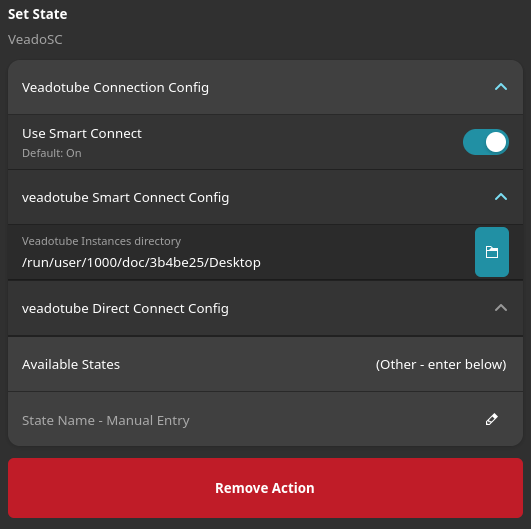
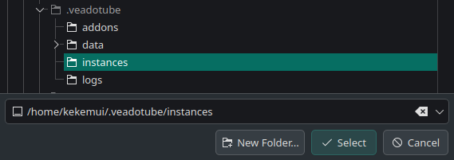

# Getting Started

VeadoSC is not yet a part of the StreamController store. VeadoSC can be installed as a custom plugin by directly adding this repository to StreamController.

## Installation

1. From the StreamController main screen, click the hamburger menu (:octicons-three-bars-16:) and select `Open Settings`.
2. Select the `Store` tab.
3. Enable `Custom Plugins`, then click the `+` button in the `Custom Plugins` row.
4. Use these values for the repository and branch:
    * Repository: `https://github.com/Kekemui/VeadoSC`
    * Branch: `main`
5. Finally, open the plugin store as usual (hamburger > `Open Store`), find VeadoSC, and click the `install` button.

## Connecting to veadotube

There are two ways to connect VeadoSC to veadotube: "Smart Connect" and "Direct Connect". "Smart Connect" uses the instance data veadotube writes out to disk, while "Direct Connect" requires configuration of a static port inside of veadotube. For most users, we recommend "Smart Connect".

### Smart Connect (Recommended)

To use Smart Connect, we need to tell VeadoSC where to find your veadotube data.[^1]

1. Start veadotube
    * This step is optional, but recommended. Opening veadotube will give feedback when you have
      configured VeadoSC correctly, and ensures that the directory we need to select exists.
2. In StreamController, select a blank button, select `Add Action`, `VeadoSC`, then finally either
    `Set State` or `Toggle State`. You should see a white "Disconnected" icon appear on the button.
3. On the left side of the app, click `Set State` or `Toggle State` (depending on what you chose
    previously). You should see a panel similar to below. Expand `Veadotube Connection Config` if
    necessary, and ensure `Use Smart Connect` is on (switch is to the right).

    

4. Open the folder chooser dialog by clicking the blue folder icon.
5. veadotube writes information about how to connect in the `~/.veadotube/instances` directory,
    even if you're using a portable install. Ensure you're in your home directory in the pop-up,
    expand `.veadotube`, then select `instances`. Click `Select`. 

    !!! warning

        "Dot-files", like `.veadotube`, are hidden by default in UIs in Linux. You may need to press
        `Ctrl + H` to show hidden files.

    

6. If you've done everything correctly and if veadotube is running, you should see the button icon
    change to a square with a cross. If you see this, congratulations, you've connected to
    veadotube! You can now use the "Available States" menu to select which version of your PNGTuber
    you'd like this button to select.

[^1]:
    Usually, we'd be able to default to the known location of your veadotube data. However, 
    Flatpak applications like StreamController obscure the real location of data on your computer,
    and what might be at `/home/<user>/.veadotube/instances` will appear to a Flatpak application
    as something like `/run/user/<user_id>/doc/1a2b3c4d/instances`, and only after a user explicitly
    selects that directory.

### Direct Connect

Direct Connect requires a static websocket port in veadotube. To configure a static port, use the following steps:

1. In veadotube, open the `Program Settings` flyout (left side, looks like an application window with a cursor)
2. In the `server address` row, include a port along with localhost, like the following: `localhost:40404`. You can use any port between 1024-65535, not withstanding any port currently in use by your computer.
3. **Remember this port**.

Next, add a VeadoSC action in StreamController:

1. Select a button where you'd like to control veadotube. Add the SetState action.
2. In the action configuration, set the "Veadotube IP Address" to the server (this is almost certainly `localhost`).
3. Set the "Veadotube Static Port" to the port you used earlier (`40404` if you followed the example verbatim).
4. Finally, set the "State Name" you'd like to use for this button.
    * For additional buttons, you only need to set this "State Name".

## Adding a new Action
